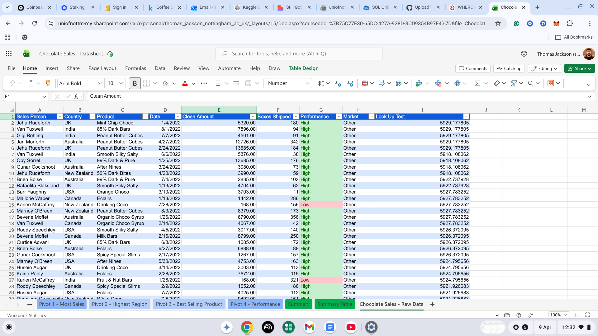
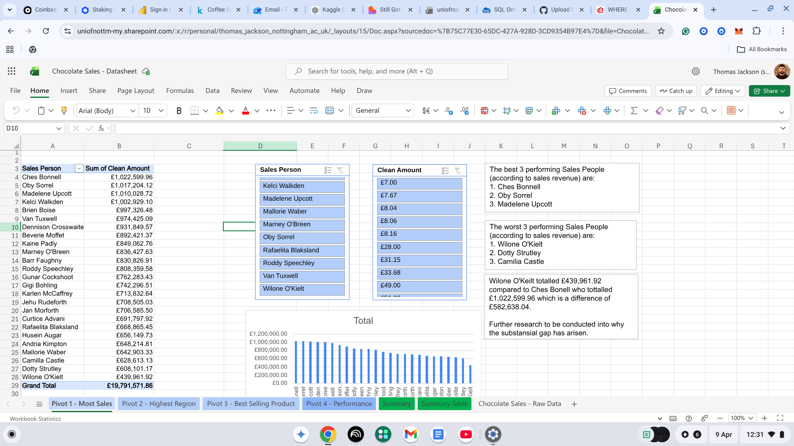
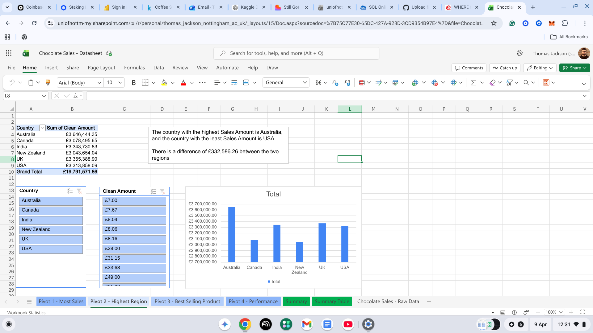
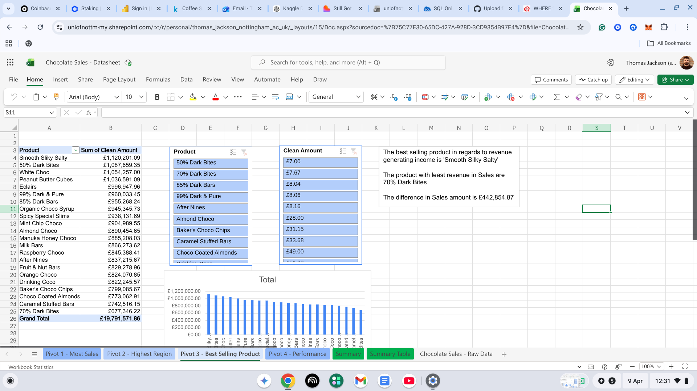
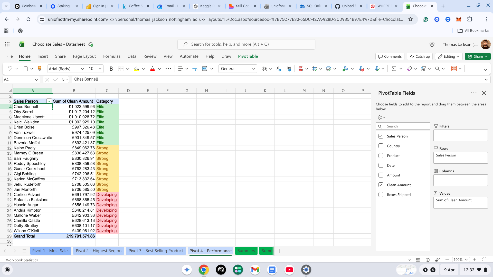

# Excel Analysis

## Overview
Data cleaning and analysis of a chocolate sales dataset using Excel Online.

## Skills Demonstrated
- Data cleaning using VALUE, SUBSTITUTE, and IF formulas
- Pivot tables and slicers
- Conditional formatting
- XLOOKUP
- Data visualisation with charts

## Analysis

### Raw Data

### Pivot 1 - Most Sales

### Pivot 2 - Highest Region

### Pivot 3 - Best Selling Product

### Pivot 4 - Salesperson Performance

### Summary Table

