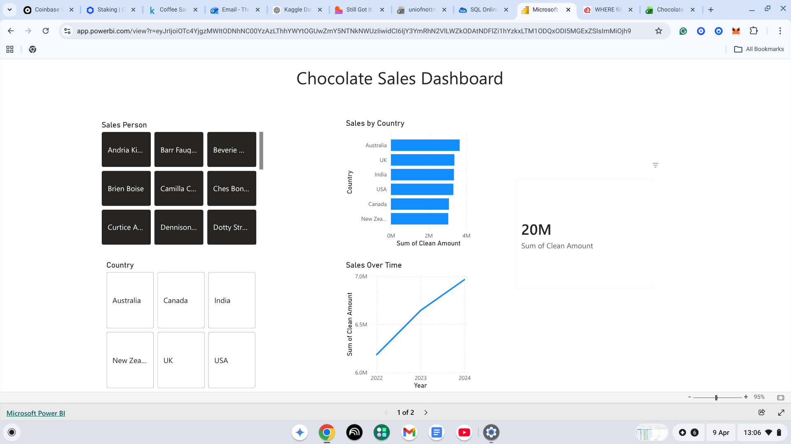
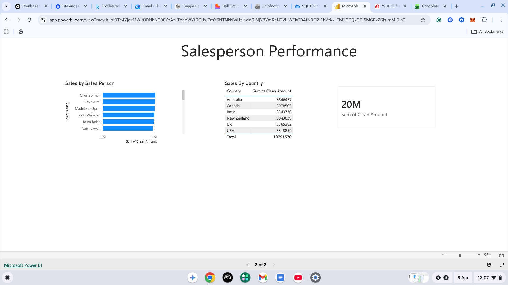

# Power BI Analysis

## Overview
Built an interactive dashboard using the chocolate sales dataset to visualise 
key trends and performance metrics across regions, products, and salespeople.

## Tools Used
- Power BI Desktop
- Dataset: Chocolate Sales (Kaggle)

## Skills Demonstrated
- Connecting and loading data into Power BI
- Building interactive dashboards
- Creating visualisations including charts and tables
- Filtering and slicing data
- Measuring salesperson performance

## Dashboard

### Overview Dashboard

### Salesperson Performance

