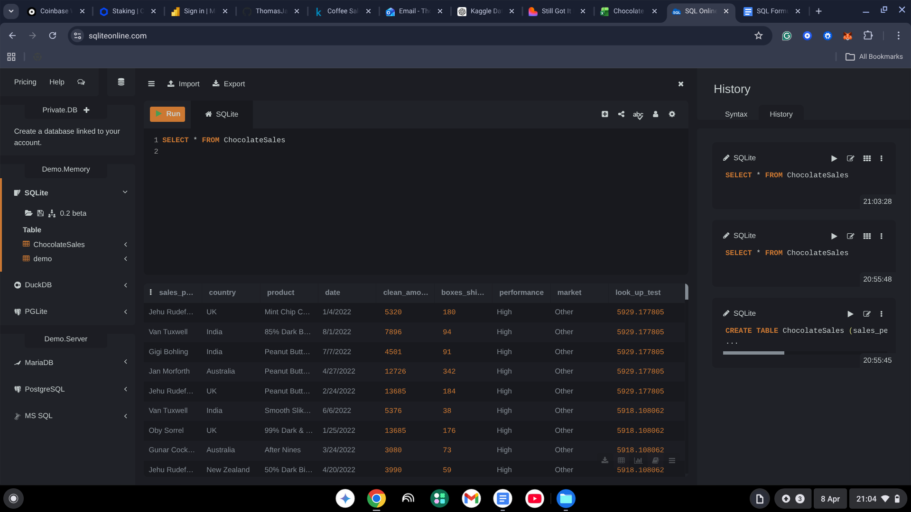
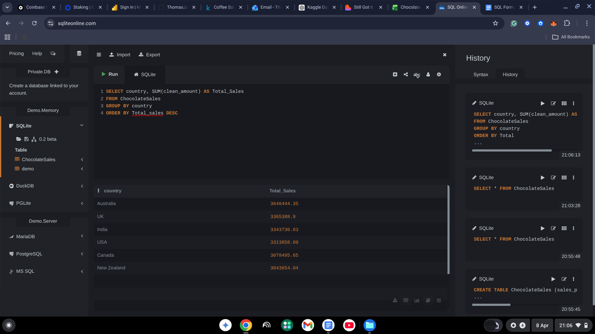
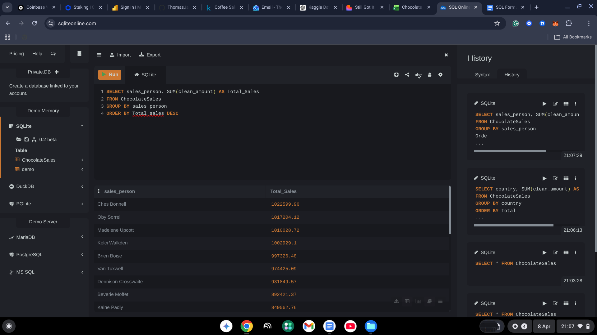
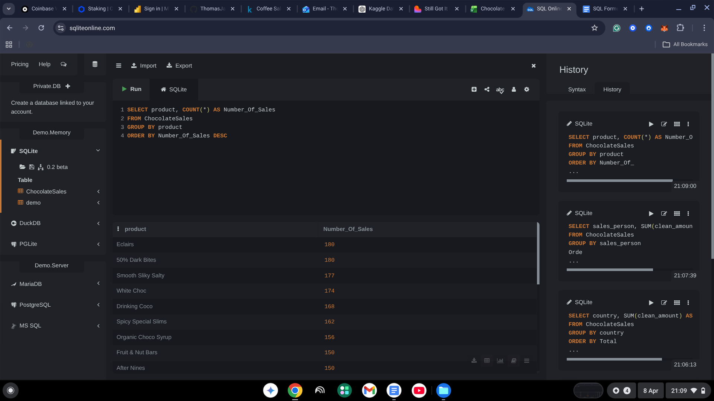
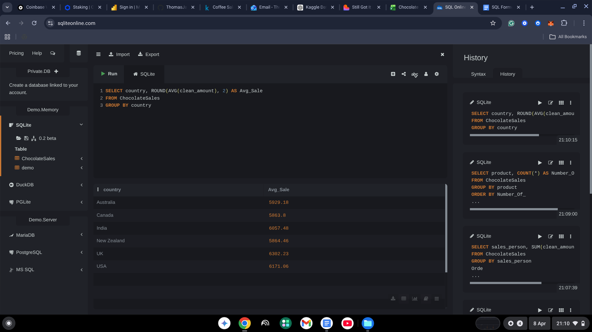
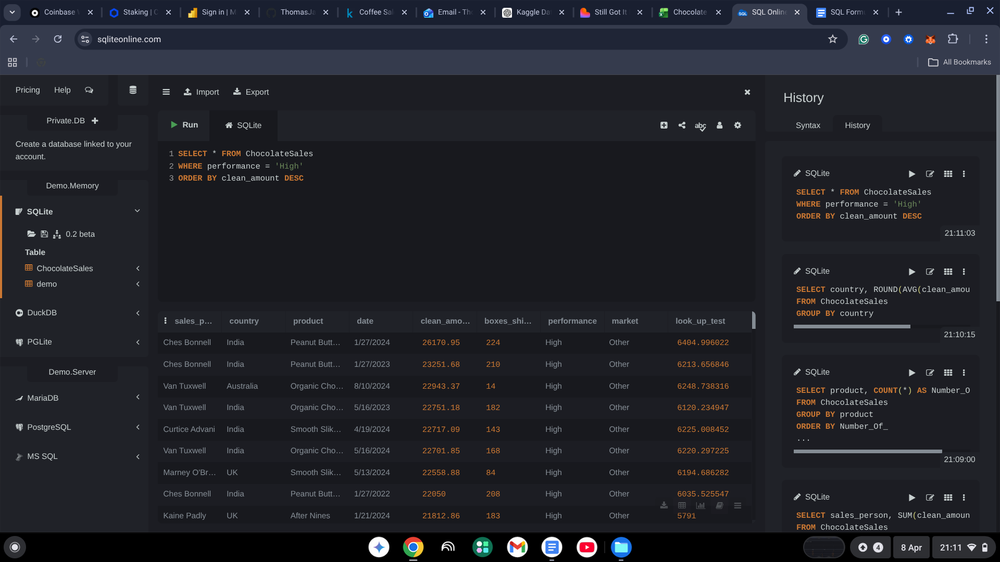

# SQL Analysis

## Overview
Imported the chocolate sales dataset into SQL and performed a range of 
queries to analyse sales performance, top products, and regional trends.

## Tools Used
- SQLite Online
- Dataset: Chocolate Sales (Kaggle)

## Skills Demonstrated
- SELECT, FROM, WHERE, GROUP BY, ORDER BY
- Aggregate functions: SUM, COUNT, AVG, ROUND
- Filtering with WHERE and HAVING
- Aliasing with AS

## Queries & Results

### Query 1 - View All Data

### Query 2 - Total Sales by Country

### Query 3 - Best Performing Salesperson

### Query 4 - Sales Count by Product

### Query 5 - Average Sale by Country

### Query 6 - High Performers Only

